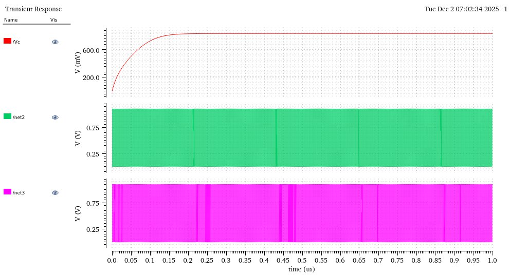
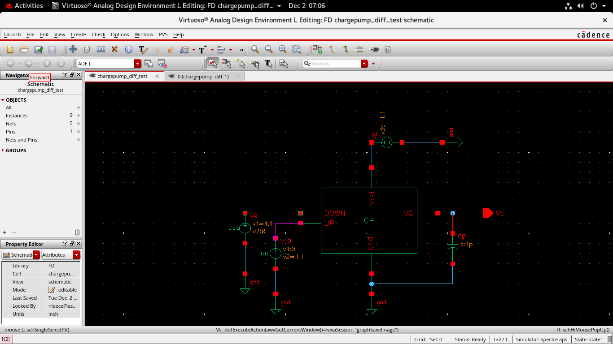
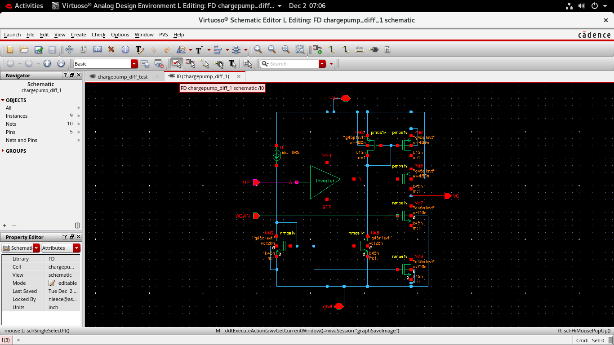

# Mixed-Signal-Circuit-Design-
Documentation of the design project for Mixed signal circuits

# Design of Charge Pump with Low Current-Mismatch and Low Glitches
# PLL
PLL is closed loop negative feedback system which maintains same phase as the reference signal.
It is used in signal synchronization, communication systems.
# Use of Charge Pump 
It is a type of DC-DC converter which uses capacitors to store charge through which it either raises or lowers the voltage levels
Charge Pumps are very important components in the PLL(Phase Lock Loop).
It is used in PLL to convert the error signal generated by the PFD(Phase Frequency Detector) to it’s equivalent  Control voltage which controls the frequency of the VCO.
# Working of CP
A Charge Pump  converts the digital UP and DOWN control signals (generated by the Phase-Frequency Detector) into analog currents. These currents are then integrated by the Loop Filter to generate the control
voltage for the VCO.
## Simulation Waveforms

### **Transient Response**

---

## Cadence Schematic — Testbench View

---

## Cadence Schematic — Charge Pump Circuit

---

